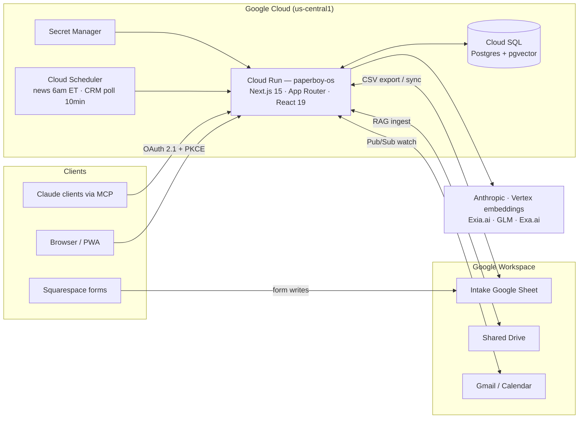
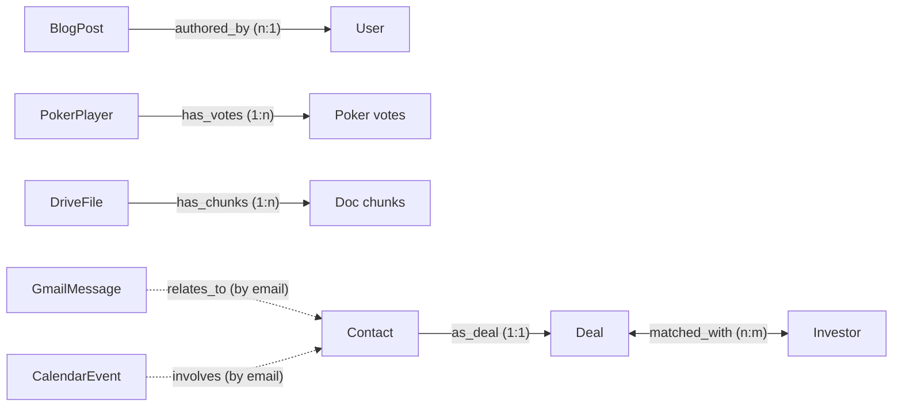

# Paperboy OS

**The operating system for Paperboy Ventures** — one authenticated console that runs the fund's day-to-day: a Google-Sheet-synced investment CRM, a Drive-grounded AI agent, an LP portal, an events desk, a daily CPG news loop, a publishing stack, and the public marketing site — all in a single Next.js 15 app deployed on Google Cloud Run.

> [!WARNING]
> **Production is currently suspended.** The GCP billing account was closed on **2026-08-11**, which suspended Cloud Run and the Cloud SQL database. The code is complete and deployable; restoring billing brings the stack back. The cost-control migration is scripted and ready in [`ops/db-downsize.sh`](ops/db-downsize.sh) (~$1,100/mo → ~$10–15/mo).

---

## Table of contents

- [What it is](#what-it-is)
- [Architecture](#architecture)
- [The ontology](#the-ontology)
- [Key subsystems](#key-subsystems)
- [History of the engagement](#history-of-the-engagement)
- [Running locally](#running-locally)
- [Deployment & operations](#deployment--operations)
- [Repository layout](#repository-layout)
- [Document index](#document-index)

---

## What it is

Paperboy OS bundles every internal tool the fund uses behind one login, plus the public site and an investor portal — five audiences, one codebase:

| Surface | Route group | Who sees it |
|---|---|---|
| **The OS console** | `app/(os)` | Staff (`admin` / `internal`) — the full toolset below |
| **Public site** | `app/(site)` | Everyone — home, apply, deals, jobs, portfolio, press, event RSVP |
| **LP portal** | `app/(portal)` | Invited investors — updates, documents, portfolio |
| **Mobile PWA** | `app/(mobile)/m` | Staff phones — an installable, CRM-only app with lock-screen push |
| **Remote MCP server** | `app/api/mcp` + `app/oauth` | Staff's own Claude clients, via OAuth 2.1 |

### The console modules

| Module | Route | What it does |
|---|---|---|
| Dashboard | `/dashboard` | KPIs, calendar, inbox, and news panels |
| Ask Paperboy | `/chat` | Drive-grounded AI agent — RAG over the Shared Drive, artifacts, file generation, tool use |
| Investment CRM | `/crm` | The deal pipeline — kanban over seven seasons of brand applications, synced live from the intake Google Sheet |
| Investors | `/investors` | ~460-record CPG investor database with a D3 map |
| Talent | `/talent` | Talent pipeline CRM |
| Events | `/events` | "The Paperboy Invitational" — RSVPs, pairings, live scoring, sponsors |
| Poker | `/poker` | Tournament vote tally |
| The Front Page | `/blog` | Substack-style blog editor (Tiptap) |
| News | `/news` | Daily CPG news editions, auto-curated at 6am ET via Exa.ai |
| Newsletter | `/newsletter` | Beehiiv-backed sends |
| Documents | `/documents` | Artifacts produced by the agent, versioned |
| Brand Library | `/brands` | Brand asset library |
| Site Editor | `/site-editor` | Wix-style visual editor for the public site, with draft/publish and version snapshots |
| Admin | `/admin/*` | Member and invite management |

Two vision tiles — **Matching** and **Content Studio** — are deliberate stubs routing to `/coming-soon`.

---

## Architecture

There is no separate backend. The Next.js app **is** the server: ~70 API route handlers under `app/api/` own all database and AI access; the browser never touches Postgres or model keys.



**The load-bearing decisions:**

- **Dual-mode DB client** ([`lib/db/index.ts`](lib/db/index.ts)) — connects over the Cloud SQL Unix socket when `INSTANCE_CONNECTION_NAME` is set (Cloud Run), otherwise `DATABASE_URL` (local). The pool is intentionally lazy so `next build` never needs a database.
- **Edge/Node auth split** — [`auth.config.ts`](auth.config.ts) is edge-safe (no DB, no bcrypt) and is all [`middleware.ts`](middleware.ts) uses; [`auth.ts`](auth.ts) is the full Node config (Drizzle adapter + Credentials + bcrypt). Auth.js v5 with JWT sessions. Middleware enforces *authentication* only; **role checks live server-side** in [`lib/auth/guards.ts`](lib/auth/guards.ts).
- **Four roles** — `admin`, `internal` (staff, Google sign-in, domain-restricted, auto-promoted), `client` (invited, email+password), `investor` (LP, portal-only).
- **Module-per-tool layout** — each tool is a triplet: `app/<module>/page.tsx` + `components/<module>/` + `lib/<module>/`. Migrating a module from prototype to DB never changes its UI shape: the API layer re-maps DB rows to the legacy types.
- **The OS is itself an OAuth 2.1 authorization server** (`app/oauth/*`, `app/.well-known/oauth-*`) — dynamic client registration (RFC 7591), PKCE S256, short-lived JWTs — so staff can add Paperboy OS as a custom connector inside their own Claude.

---

## The ontology

The data model exists at two levels: the **relational schema** (what Postgres stores) and a **typed ontology layer** (what the agent reasons over).

### Level 1 — the relational schema

[`lib/db/schema.ts`](lib/db/schema.ts): **40 tables, 6 enums**, one file, heavily commented. Grouped by domain:

| Domain | Tables |
|---|---|
| **Identity & platform** | `user` · `account` · `session` · `verification_token` · `invite` · `google_credential` · `user_preference` · `notification` · `push_subscription` |
| **Chat & artifacts** | `chat` · `chat_message` (with `parts` — the full agent trace) · `chat_file` · `artifact` · `artifact_version` |
| **RAG & Google sync** | `drive_file` (with `accessors` — the permission gate) · `doc_chunk` (`vector(768)`, HNSW cosine index) · `gmail_message` · `calendar_event` · `sync_channel` |
| **Investment CRM** | `brand_app` (sheet-synced applications) · `inquiry` (website leads) — unioned into one pipeline |
| **Investors & LP portal** | `investor` · `lp_profile` · `portal_update` · `portal_document` (fail-closed sharing) · `portfolio_company` |
| **Events** | `event` · `event_pairing` · `event_rsvp` · `event_score` · `event_sponsor` |
| **Content & site** | `blog_post` · `news_item` · `subscriber` · `job_submission` · `talent` · `site_page` · `site_page_version` · `site_asset` |
| **Poker** | `poker_player` · `poker_vote` (live tally = base votes + Σ deltas) |
| **MCP auth server** | `mcp_client` · `mcp_auth_code` · `mcp_refresh_token` |

Two invariants worth knowing before touching anything:

- **`brand_app.stage` / `fund` / `archived` / `aiOnePager` exist only in Postgres.** The Google Sheet owns the other nine columns (see [the CRM sync](#the-sheet-synced-crm)); writing a whole row from the sheet would wipe the kanban.
- **Fail-closed sharing** — new `portal_document` and `portfolio_company` rows default to hidden; LP `notes` are internal-only and never serialized to the portal.

### Level 2 — the typed ontology (`lib/ontology/`, 40 files)

A Palantir-style semantic layer over the schema — the vocabulary the AI agent and the generic `api/ontology/*` endpoints operate on:

- **13 object types** (`objects/`): `User`, `Investor`, `Deal`, `Contact`, `BlogPost`, `NewsItem`, `PokerPlayer`, `Subscriber`, `DriveFile`, `Chat`, `Invite`, `GmailMessage`, `CalendarEvent`.
- **4 interfaces** (`interfaces.ts`): `Contactable` · `Searchable` · `Stageable` · `Locatable` — cross-cutting capabilities objects can implement.
- **11 typed links** (`links.ts`) with declared cardinality — including two FK-less links resolved at query time by email matching:



- **12 action handlers** (`actions/handlers/`): `create-deal`, `update-deal`, `cast-vote`, `eliminate-player`, `add-subscriber`, `submit-inquiry`, `sync-gmail`, `sync-calendar`, `sync-drive`, and more — every mutation the agent may propose goes through a typed, validated action, surfaced to the user as an approval card before execution.
- **A guarded query layer** (`query.ts`): `Chat`, `GmailMessage`, and `CalendarEvent` are `OWNER_SCOPED` — the agent can never read another user's mail, calendar, or conversations.
- **The agent executor** (`agent/`): prompt assembly, tool definitions, and the loop that lets "Ask Paperboy" traverse the ontology instead of raw SQL.

---

## Key subsystems

### The sheet-synced CRM

The system of record for brand applications is a Google Sheet (`paperboyventures_DEALS_brandapps_szn4`) — Squarespace form blocks write into it natively, and the OS reflects it. [`lib/crm/sheet-sync.ts`](lib/crm/sheet-sync.ts) pulls it on read (throttled to one Drive fetch per 60s, fail-open so a Drive outage serves stale rows rather than an empty pipeline). The design that keeps it stable:

- **Field-scoped, never a row mirror** — only nine `SHEET_OWNED` columns are ever written; pipeline state (`stage`, `fund`, `archived`, `aiOnePager`) is Postgres-only.
- **Blank ≠ clear** — empty sheet cells never erase known data.
- **Two-index matching** — normalized company name, then website/email domain, because three historical sheets have no company column ("Capecodr" vs "Cape Cod'r").
- **Convergent dedup** — rows resolve to a target record *first* and dedupe last-wins *by target id*, so re-applications ("Bella Bread Co." vs "Bella Bread Company") converge to one record instead of fighting forever.

`scripts/import-brand-apps.ts` was the one-shot backfill of all seven seasons.

### Drive-grounded chat ("Ask Paperboy")

RAG over the fund's Shared Drive: ingest (`lib/rag/`) → Vertex AI embeddings → `pgvector` HNSW retrieval — **permission-aware**: every chunk is filtered to files the signed-in staff member can actually open, via `drive_file.accessors`. Chat routes to Claude (Anthropic SDK), Exia.ai, and GLM; responses stream with citations, tool calls render live, and generated files become versioned artifacts.

### The mobile PWA + push

`/m` is an installable, staff-only phone app showing exactly one screen: the CRM. A Cloud Scheduler job POSTs `/api/admin/crm/poll` every 10 minutes; new applications trigger Web Push (VAPID) lock-screen notifications that name the companies ("Fernbrook Kitchen, Nine Bar" — not "2 new applications") and deep-link into the deal. Dead subscriptions (404/410) self-clean, and no push failure can ever fail the caller's request.

### The events desk

Full tournament operations for "the Paperboy Invitational": public RSVP pages per event, approval → pairing → tee time flow, hole-by-hole live scoring (upsert on `(pairing, hole)`), and sponsor tracking with per-deliverable checklists.

---

## History of the engagement

The git log is short (the repo lived untracked inside an Obsidian vault for most of its life) — the real chronology is written in the **24 Drizzle migrations**, five **go-live scripts**, and the **loop journal**:

| When (2026) | Milestone |
|---|---|
| *Pre-engagement* | The Python/Airtable era — `archive/scripts/`: Airtable fetch/upload, company research, one-pager generation, plus a static `dashboard.html` prototype |
| *Early phase* | Next.js 15 prototype — five tools running on localStorage and hardcoded data |
| **Jun 28** | Google Cloud stood up per [`docs/SETUP_GOOGLE_CLOUD.md`](docs/SETUP_GOOGLE_CLOUD.md) — Cloud SQL created, module-by-module DB migration begins (migrations `0000`→`0023`) |
| **Jul 10** | **The self-improvement loop** — 16 autonomous build cycles in one day ([`ops/loop/JOURNAL.md`](ops/loop/JOURNAL.md)), governed by a rubric and owner-approval gates; cycle 2 caught and fixed an IDOR + fail-open bug in the ontology query layer |
| **Jul 16** | News loop live — daily 6am ET editions via Exa.ai (`ops/news-go-live.sh`) |
| **Jul 21–22** | Events/golf module + CRM repair shipped for the client meeting (`ops/meeting-prep-go-live.sh`); "The Paperboy Times" broadsheet and the six-track OCV proposal presented |
| **Jul 29** | The intake pivot — Squarespace webhook deprecated ([`ops/squarespace-intake.md`](ops/squarespace-intake.md)); **the Google Sheet becomes the system of record** and the field-scoped sync replaces it |
| **Jul 30** | ⚡ **Incident:** the Cloud SQL free trial expired and suspended prod. Recovery + hardening (`ops/db-restore.sh`): deletion protection ON, daily backups + PITR, full dump to GCS. First git commit the same day |
| **Jul 31** | Mobile app refocused — the original four-tab design (Route/Network/Desk/Pipeline) retired to [`archive/mobile/`](archive/mobile/README.md); the PWA becomes CRM-only |
| **Aug 2** | Cost control scripted — [`ops/db-downsize.sh`](ops/db-downsize.sh) to migrate off the oversized trial instance (8 vCPU/64 GB → f1-micro) |
| **Aug 3** | CRM rework + lock-screen push notifications live (`ops/push-go-live.sh`) — last production deploy |
| **Aug 11** | ⚡ **Incident:** the billing account was closed before the downsize ran; Cloud Run and Cloud SQL suspended. Awaiting billing restoration |
| **Aug 13** | Repository published to GitHub |

---

## Running locally

```bash
npm install
cp .env.example .env.local   # fill in — 31 documented variables
npm run dev                  # localhost:3000
```

```bash
npm run build      # the authoritative gate — catches edge/RSC/server-client errors typecheck misses
npm run typecheck  # tsc --noEmit
npm run lint

# Database (Drizzle ORM → Postgres; needs DATABASE_URL)
npm run db:generate   # emit SQL migration from lib/db/schema.ts
npm run db:migrate    # apply migrations
npm run db:seed       # investors + blog seed data

npm run ingest   # RAG: ingest the Shared Drive
npm run news     # generate today's news edition
```

There is no test runner — `npm run build` is the validation gate.

> [!NOTE]
> **pgvector gotcha:** `drizzle-kit` does not emit `CREATE EXTENSION vector`. It is hand-added at the top of `drizzle/0000_*.sql` — preserve it when regenerating migrations or the `doc_chunk` vector column and HNSW index will fail.

## Deployment & operations

Docker → Artifact Registry → **Cloud Run** (`paperboy-os`, `us-central1`), Cloud SQL over the Unix socket, secrets in Secret Manager, two Cloud Scheduler jobs (`paperboy-news-daily` 6am ET, `paperboy-crm-poll` every 10 min). Full runbook: [`docs/DEPLOY.md`](docs/DEPLOY.md).

Every production change shipped through an idempotent go-live script that reads secrets from gitignored `.env.local`:

| Script | Shipped |
|---|---|
| [`ops/news-go-live.sh`](ops/news-go-live.sh) | The daily news loop + scheduler |
| [`ops/meeting-prep-go-live.sh`](ops/meeting-prep-go-live.sh) | Events/golf module, CRM priority repair, intake secret |
| [`ops/db-restore.sh`](ops/db-restore.sh) | Post-suspension recovery: protection, backups, PITR |
| [`ops/db-downsize.sh`](ops/db-downsize.sh) | Migration to a right-sized DB instance (build → verify → `--cutover`) |
| [`ops/push-go-live.sh`](ops/push-go-live.sh) | Push notifications, CRM watermark, the 10-minute poll |

## Repository layout

```
app/
  (os)/          the staff console — one folder per module
  (site)/        public marketing site
  (portal)/      LP portal
  (mobile)/m/    the CRM phone app (PWA)
  api/           ~70 route handlers — the entire backend
  oauth/, .well-known/   the MCP OAuth 2.1 authorization server
components/      one folder per module (os/ is the console shell)
lib/
  db/            schema.ts (40 tables) · client · seeds
  ontology/      the typed semantic layer (objects, links, actions, agent)
  crm/           sheet sync · matching · import logic
  rag/           ingest · embeddings · permission-aware retrieval
  chat/          the agent loop and its tools
  auth/          server-side role guards
  <module>/      types + logic per tool
drizzle/         24 migrations — the project's true chronology
jobs/            containerized Cloud Run jobs (drive-ingest, knowledge-builder)
ops/             go-live scripts, incident runbooks, the loop journal
docs/            GCP setup checklist, deploy runbook, client print pieces
archive/         retired code — the Python era, the one-pager, the 4-tab mobile
scripts/         backfills and inspectors for the intake sheets
```

## Document index

| Doc | What it covers |
|---|---|
| [`CLAUDE.md`](CLAUDE.md) | Working notes for AI-assisted development |
| [`docs/SETUP_GOOGLE_CLOUD.md`](docs/SETUP_GOOGLE_CLOUD.md) | Owner-facing, click-by-click GCP standup (9 steps) |
| [`docs/DEPLOY.md`](docs/DEPLOY.md) | Schema → seed → build → deploy runbook |
| [`ops/loop/JOURNAL.md`](ops/loop/JOURNAL.md) | The 16-cycle autonomous build journal |
| [`ops/loop/RUBRIC.md`](ops/loop/RUBRIC.md) | The quality rubric and never-trade-away guardrails |
| [`ops/squarespace-intake.md`](ops/squarespace-intake.md) | Why the intake webhook is deprecated (kept as a record) |
| [`archive/mobile/README.md`](archive/mobile/README.md) | The retired phone tabs, and how to revive them |

---

*Built by [Eliyahu Cohen](https://github.com/Eco-15) with Claude, for Paperboy Ventures.*
